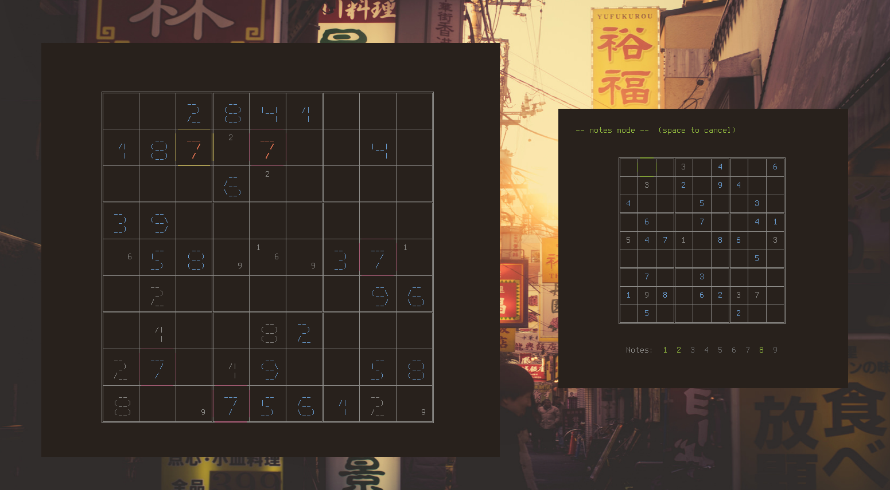

# trudoku

Trudoku is an ncurses sudoku game, written in Python using the Blessed library. It has support for taking notes on possible cell values, and displays the board in a large figlet-style font (if the terminal is large enough).

Fonts courtesy of Glenn Chappell (smshadow) and Bas Meijer (straight).

Puzzles courtesy of Ruud van der Werf of www.sudocue.net.
